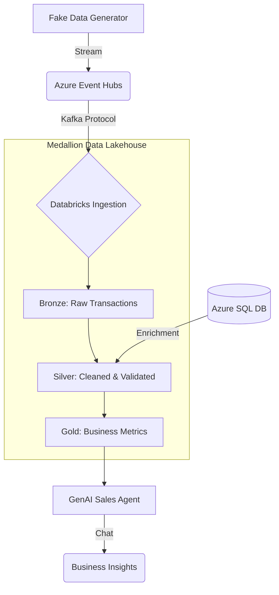

# 🚀 Azure Databricks Real-Time Sales Analytics + GenAI

> **"Turning raw data into business intelligence, instantly."**

This platform is an enterprise-grade solution for processing millions of sales transactions in real-time. It transforms messy, fast-moving data into clear, actionable insights using a sophisticated "sorting and cleaning" process, topped with an AI Brain that helps business owners "talk" to their data.

---

## 🌟 The Big Picture (Non-Technical Explanation)

Imagine a massive, global post office where millions of letters (sales records) arrive every minute from stores all over the world. 

### The Problem
If you just pile all those letters on the floor, you can't read them, you can't count them, and you definitely can't use them to make smart business decisions. 

### The Solution: Our Digital Pipeline
This project builds a state-of-the-art **sorting facility** that works automatically:

1.  **The High-Volume Intake (Event Hubs)**: Think of this as the loading dock. It can handle millions of messages at once without dropping a single one.
2.  **The Medallion Sorting Rooms**:
    *   **🥉 Bronze (The Raw Pile)**: We save everything exactly as it arrived. It's a mess, but it's safe.
    *   **🥈 Silver (The Scrubbing)**: We open every letter. We fix typos, remove duplicates, and make sure the math (Quantity × Price) actually adds up.
    *   **🥇 Gold (The Executive Briefing)**: We take the cleaned data and summarize it. Instead of millions of records, we now have beautiful reports showing: *"Which product is the #1 bestseller?"* or *"Which region is making the most profit today?"*
3.  **The AI Brain (GenAI)**: Finally, we give all those reports to an AI assistant. Instead of hunting through spreadsheets, a manager can just ask: *"Why are sales down in the West region?"* and the AI will analyze the "Gold" reports to provide a human-like answer.

**In short: We take the chaos of millions of individual sales and turn them into clear, smart answers that help a business grow.**

---

## 🏗️ Architecture

---

## 🎯 Key Features

- **Real-Time Streaming**: Uses the Kafka protocol to ingest data instantly as it happens.
- **Data Integrity**: Automated validation ensures that no bad data (negative quantities, math errors) makes it to the final reports.
- **Scalable Infrastructure**: Built entirely with **Terraform**, meaning you can deploy the whole thing with one click.
- **Generative AI (GenAI)**: Features a **Retrieval-Augmented Generation (RAG)** pipeline, allowing users to query sales data using natural language (Llama 3/OpenAI).
- **Medallion Architecture**: Industry-standard "Bronze-Silver-Gold" pattern for reliable data engineering.

---

## 📁 Project Structure

| Folder | Purpose |
| :--- | :--- |
| `notebooks/01_ingestion` | **Bronze**: Connects to the "loading dock" and saves raw data. |
| `notebooks/02_silver` | **Silver**: Cleans the data, fixes types, and removes duplicates. |
| `notebooks/03_gold` | **Gold**: Calculates revenue, best sellers, and customer loyalty. |
| `notebooks/04_enrichment` | Pulls customer names/emails from **Azure SQL** to attach to orders. |
| `notebooks/09_genai` | The **AI Brain** that powers natural language questions. |
| `terraform/` | The "Blueprints" used to build all the Azure servers automatically. |
| `scripts/` | Tools to generate "fake" sales data for testing. |

---

## 🚀 Getting Started

### 1. Prerequisites
- An active **Azure Subscription**.
- A **GitHub Personal Access Token** (for Databricks Repo sync).

### 2. Deployment (One-Click)
1. Go to your GitHub Repository → **Actions**.
2. Select the **"Deploy Azure Databricks Pipeline"** workflow.
3. Click **Run workflow** and select `trial` for the Databricks SKU.
4. Wait ~12 minutes for Terraform to build the entire cloud environment.

### 3. Run the Pipeline
Once deployed, trigger the same workflow but select **`run-pipeline`** in the "Action" dropdown. This will:
1. Generate thousands of fake sales.
2. Stream them into the pipeline.
3. Process them through Bronze, Silver, and Gold layers.

---

## 💰 Cost Optimization
This project is designed for learning and uses the most cost-effective resources:
- **Databricks**: Optimized auto-termination (shuts down after 10 mins of inactivity).
- **Azure SQL**: Uses the "Free" tier (compatible for 12 months).
- **Storage**: Uses LRS (Locally Redundant) to minimize costs.

---

## 🛠️ Technologies
- **Infrastucture**: Terraform, GitHub Actions
- **Compute**: Azure Databricks (Spark)
- **Streaming**: Azure Event Hubs
- **Storage**: Delta Lake, ADLS Gen2
- **Database**: Azure SQL
- **AI**: LangChain, Mosaic AI, Llama 3

---

*Built for learning and enterprise-scale testing. MIT Licensed.*
